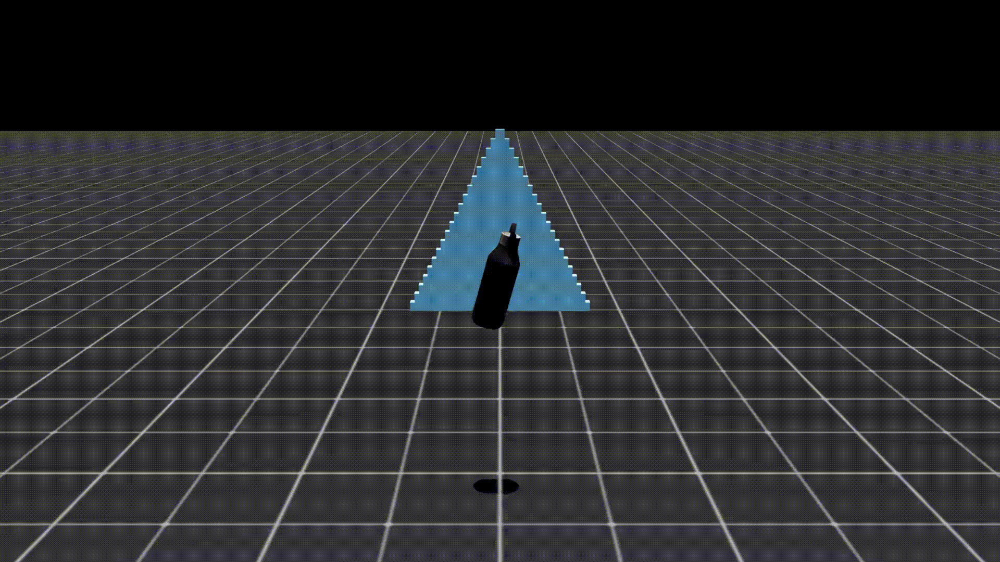

# scan2wall

**Scan objects and simulate throwing them at a wall using AI and physics.**



A hackathon project for NVIDIA's Simulation Hack that combines phone camera capture, AI-powered 3D mesh generation, material property inference, and realistic physics simulation.

## How It Works

1. 📱 Take a photo of any object on your phone
2. ⬆️ Upload via web interface (QR code provided)
3. 🤖 AI generates 3D mesh and infers material properties
4. 🎮 Object gets thrown at a pyramid in Isaac Sim
5. 🎬 Watch the simulation video

**Total time: ~1-2 minutes**

## Tech Stack

- **3D Generation**: [Hunyuan 3D 2.1](https://github.com/Tencent/Hunyuan3D-2) via [ComfyUI](https://github.com/comfyanonymous/ComfyUI)
- **Material Analysis**: Google Gemini 2.0 Flash
- **Physics Simulation**: NVIDIA Isaac Sim
- **Backend**: FastAPI, Python 3.11
- **Frontend**: HTML5 + JavaScript

## Quick Start

### Prerequisites

**Flexible deployment options:**

**Option A: Two-Instance Setup** (Recommended)
1. **Linux instance** with NVIDIA GPU (8GB+ VRAM) - for 3D generation
2. **Isaac Sim instance** - for physics simulation

**Option B: Single-Instance Setup** (For demos/development)
1. **One powerful machine** with 16GB+ VRAM GPU and Isaac Sim installed

### Installation

**Instance 1 (Linux + GPU):**
```bash
# Clone and setup
git clone https://github.com/max-seeli/scan2wall.git
cd scan2wall

# Install dependencies
curl -LsSf https://astral.sh/uv/install.sh | sh
uv sync && uv pip install -e .

# Setup ComfyUI and download models
cd 3d_gen
bash setup_comfyui.sh
bash modeldownload.sh
```

**Instance 2 (Isaac Sim):**
```bash
# Follow: https://github.com/isaac-sim/isaac-launchable
# Then clone repo into workspace
git clone https://github.com/max-seeli/scan2wall
cd scan2wall
uv sync && uv pip install -e .
# Install ffmpeg
```

### Configuration

```bash
cp .env.example .env
```

Edit `.env`:
- **Required**: `GOOGLE_API_KEY` - Get from [Google AI Studio](https://makersuite.google.com/app/apikey)
- **Required**: `ISAAC_INSTANCE_ADDRESS`
  - Two-instance: `https://<PORT>-<INSTANCE>.brevlab.com/process`
  - Single-instance: `http://127.0.0.1:8012/process`
- **Optional**: `PORT` (default: 49100)
- **Optional**: Path customization (auto-detected by default)

### Running

**Instance 1 - Terminal 1 (ComfyUI):**
```bash
cd 3d_gen
source .venv/bin/activate
cd ComfyUI
python main.py --listen 0.0.0.0 --port 8188
```

**Instance 1 - Terminal 2 (ComfyUI API):**
```bash
cd 3d_gen
source .venv/bin/activate
python server.py
```

**Instance 2 (Upload Server):**
```bash
uv run src/scan2wall/image_collection/run.py
```

Scan the QR code or visit the URL on your phone to start!

## Features

✅ Mobile-first web interface
✅ Real-time job status updates
✅ AI-powered material inference (mass, friction, dimensions)
✅ State-of-the-art 3D generation
✅ Realistic physics simulation
✅ Automatic video recording

## Documentation

- **[SETUP.md](SETUP.md)** - Detailed installation guide
- **[ARCHITECTURE.md](ARCHITECTURE.md)** - System architecture and technical details
- **[EMAIL_INTEGRATION.md](EMAIL_INTEGRATION.md)** - Future email feature design

## Project Structure

```
scan2wall/
├── src/scan2wall/
│   ├── image_collection/    # Upload server and web UI
│   └── material_properties/  # Gemini API integration
├── 3d_gen/                  # ComfyUI and 3D generation
├── isaac_scripts/           # Isaac Sim simulation scripts
└── recordings/              # Generated videos
```

## API Endpoints

- `GET /` - Upload page
- `POST /upload` - Submit image
- `GET /job/{job_id}` - Check job status
- `GET /jobs` - List all jobs (admin)

## Troubleshooting

**Can't connect from phone?**
- Ensure same WiFi network
- Check firewall allows the port

**ComfyUI model not found?**
- Re-run `modeldownload.sh`

**Isaac Sim crashes?**
- Check VRAM usage
- Reduce simulation resolution

See [SETUP.md](SETUP.md) for more troubleshooting.

## Future Ideas

- 📧 Email integration
- 🎨 Custom simulation settings
- 🌐 Public gallery
- 🔗 Social media sharing

## Built For

**NVIDIA Simulation Hack** (October 10-12, 2025)

This project showcases the integration of multiple cutting-edge AI and physics systems:
- Tencent's Hunyuan 3D 2.1 for image-to-3D generation
- Google's Gemini 2.0 Flash for intelligent material property inference
- NVIDIA's Isaac Sim for high-fidelity physics simulation

## License

MIT License - see [LICENSE](LICENSE) file for details

## Acknowledgments

Special thanks to NVIDIA for hosting the Simulation Hack and providing Isaac Sim access!

## Contact

Issues: [GitHub Issues](https://github.com/max-seeli/scan2wall/issues)
